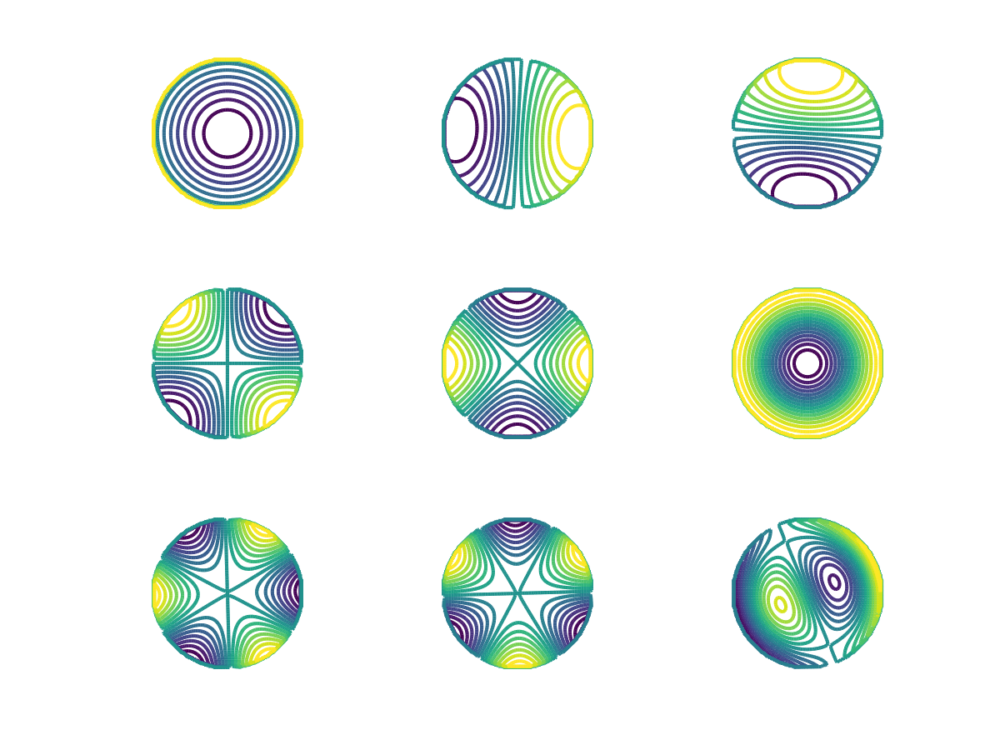

# EigenApprox

Octave code to approximate kernel eigenfunctions in a Mercer expansion.



## Background
Every strictly positive definite and continuous kernel  on a bounded set  can be written as


with 


This code approximates the unknown eigenfunctions  and eigengvalues  using the knowledge of  and .

The code implements the algorithm of
> G. Santin and R. Schaback, [Approximation of Eigenfunctions in Kernel-based Spaces](https://link.springer.com/article/10.1007/s10444-015-9449-5), Adv. Comput. Math., Vol. 42 (4), 973–993 (2016)
(see also the [preprint](https://arxiv.org/abs/1411.7656)).

## Quick start

You can start with one of the demos:
* [ApproximateEigenbasis1D.m](ApproximateEigenbasis1D.m): Example with the Matèrn kernel on an interval.
* [ApproximateEigenbasis.m](ApproximateEigenbasis.m): Example with the Gaussian kernel on the unit disk.

Notice that both demos actually compute the eigenbasis elements as , i.e., with a normalization that makes them orthonormal in the RKHS of the kernel.


## How to cite:
If you use this code in your work, please consider citing the paper

```bibtex:
@Article{Santin2016,
  author    = {Santin, Gabriele and Schaback, Robert},
  title     = {Approximation of eigenfunctions in kernel-based spaces},
  journal   = {Adv. Comput. Math.},
  year      = {2016},
  volume    = {42},
  number    = {4},
  pages     = {973--993},
  issn      = {1572-9044},
  doi       = {10.1007/s10444-015-9449-5},
}
```

Latex formulas are rendered using [https://jsfiddle.net/8ndx694g/](https://jsfiddle.net/8ndx694g/).
